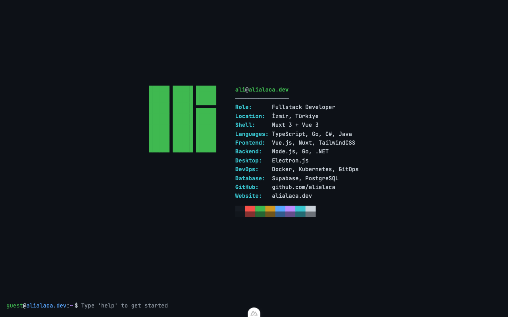

# alialaca.dev

Terminal temalı, interaktif portfolyo web uygulaması. Gerçek bir Linux terminali gibi çalışan, komut satırı arayüzüyle portfolyo deneyimi sunar.

🔗 **[alialaca.dev](https://alialaca.dev)**


<p align="center">
  
</p>

## Özellikler

- **Terminal Arayüzü** — Gerçek bash deneyimi: komut geçmişi, tab completion, Ctrl kısayolları
- **Sanal Dosya Sistemi** — Unix benzeri dizin yapısında projeler, blog yazıları ve özgeçmiş
- **Neofetch Karşılama** — Profil bilgileri ve renk paleti ile açılış ekranı
- **Dosya Görüntüleyici** — Vim tarzı tam ekran markdown okuyucu
- **Analitik** — Umami ile gizlilik odaklı, cookie-free ziyaretçi takibi
- **Monogram Favicon** — SVG ve PNG fallback ile özel favicon
- **Docker Desteği** — Tek komutla production deployment

## Hızlı Başlangıç

```bash
# npm
npm install
npm run dev

# Docker
docker compose up --build
```

Uygulama `http://localhost:3000` adresinde çalışır.

## Komutlar

| Komut | Alias | Açıklama |
|-------|-------|----------|
| `help` | | Kullanılabilir komutları listeler |
| `pwd` | | Mevcut dizini gösterir |
| `ls [-la]` | `ll`, `la` | Dizin içeriğini listeler |
| `cd <path>` | | Dizin değiştirir (`~` destekler) |
| `cat <file>` | | Dosya içeriğini tam ekranda görüntüler |
| `tree` | | Dizin yapısını ağaç olarak gösterir |
| `clear` | `cls` | Terminali temizler |
| `whoami` | | Mevcut kullanıcıyı gösterir |
| `login` | | Sisteme giriş yapar |
| `logout` | | Sistemden çıkış yapar |

## Klavye Kısayolları

| Kısayol | İşlev |
|---------|-------|
| `↑` / `↓` | Komut geçmişinde gezinme |
| `Tab` | Otomatik tamamlama |
| `Ctrl+L` | Ekranı temizle |
| `Ctrl+C` | Komutu iptal et |
| `Ctrl+U` | Satırı temizle |
| `ESC` / `q` | Dosya görüntüleyiciden çık |

## Proje Yapısı

```
├── components/
│   ├── TerminalApp.vue          # Ana terminal bileşeni
│   ├── Terminal/                 # Input, Output, Prompt, Neofetch
│   └── Viewer/                  # FileViewer, MarkdownRenderer
├── composables/
│   ├── useCommands.ts           # Komut tanımları ve işleyicisi
│   ├── useTabCompletion.ts      # Tab completion mantığı
│   └── useTracking.ts           # Umami analitik entegrasyonu
├── stores/                      # Pinia: auth, fileSystem, terminal
├── data/filesystem.json         # Sanal dosya sistemi içeriği
└── assets/css/terminal.css      # Terminal teması ve stiller
```

## Teknolojiler

| Kategori | Teknoloji |
|----------|-----------|
| Framework | Nuxt 4 (Vue 3) |
| Dil | TypeScript |
| Stil | TailwindCSS v4 |
| State | Pinia |
| Markdown | markdown-it |
| Analitik | Umami |
| Deploy | Docker + Docker Compose |

---

<p align="center">
  <a href="https://alialaca.dev">alialaca.dev</a>
</p>
